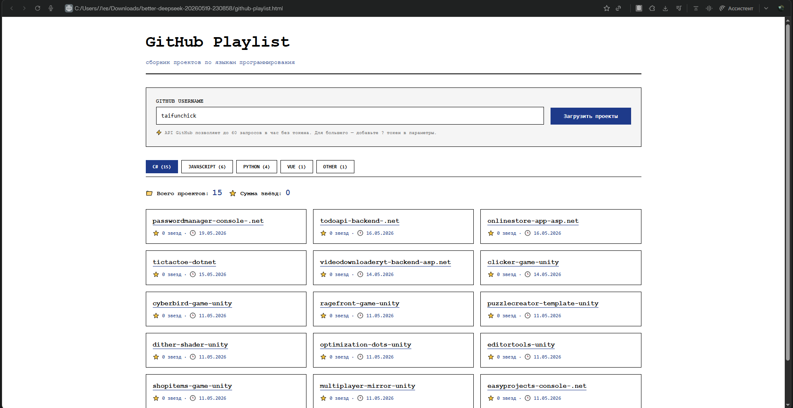

# GitHub Playlist

An interactive collection of your GitHub projects, grouped by programming language.

## Features

- 📂 Automatically fetches all public repositories via GitHub API
- 🏷️ Groups projects by language (Python, JavaScript, Go, Rust, etc.)
- 🔄 Switch between languages using tabs
- 📊 Statistics: project count and total stars
- 🎨 Minimalist black-and-white design with Deep Blue accents

## How to Use

1. Open `github-playlist.html` in any browser
2. Enter your GitHub username
3. Click "Load Projects"
4. Click on language tabs to filter

## Requirements

- Modern browser (Chrome, Firefox, Safari, Edge)
- GitHub API (public repos, no auth — 60 requests/hour)

## Screenshots

## Note

To bypass GitHub API rate limits, add a [personal access token](https://github.com/settings/tokens) as a URL parameter `?token=your_token` or modify the code.
